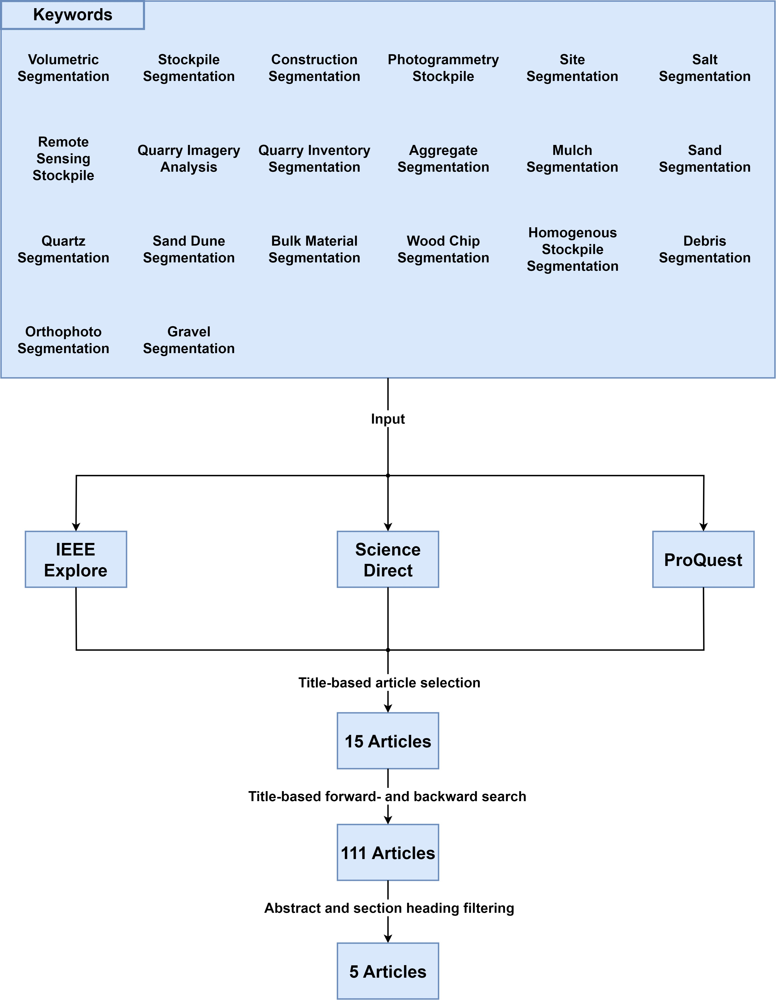

# Photogrammetry-Based Segmentation and Volume Calculation of Homogeneous Sand Piles

This GitLab repository contains the code for the paper: **Photogrammetry-Based Segmentation and Volume
Calculation of Homogeneous Sand Piles** which was presented at the IEEE 4th International Conference on Computing and Machine Intelligence (ICMI 2025, Michigan, USA) on April 05-06, 2025.

Below are the system requirements, setup details, and a detailed description of the literature review.

## System Requirements
**Operating System**: Ubuntu 22.04 LTS (tested exclusively on this OS)  
**Graphics Card**: NVIDIA GPU

---

## Setup for Fetching the Project
1. Install Git [(Guide to installing Git)](https://git-scm.com/book/en/v2/Getting-Started-Installing-Git)
2. Clone the repository.

---


## Please note: Availability of further test files in the cloud
Due to the file size, additional test files are already available for download in the following cloud directory:
https://cloud.uol.de/s/jpqS5niq3HcBaAt
Directories that are dependent on the prior integration of these files during execution are identified by an “Installation_Note” file

---

## Setup for the Conda Environment with Dependencies and CUDA/cuDNN
1. Install Conda [(Guide to installing Conda)](https://conda.io/projects/conda/en/latest/user-guide/install/index.html)
2. Create the Conda environment in the terminal:
    ```bash
    conda create -n py310cudaSegmentStockpile python=3.10
    ```
3. Activate the Conda environment in the terminal:
    ```bash
    conda activate py310cudaSegmentStockpile
    ```
4. Install PyTorch in the Conda environment for NVIDIA GPUs:
    ```bash
    conda install pytorch==2.3.0 torchvision==0.18.0 torchaudio==2.3.0 pytorch-cuda=11.8 -c pytorch -c nvidia
    ```
5. Update the Conda environment:
    Navigate to the root directory of the cloned project:
    ```bash
    cd <root of the cloned project>
    ```
    Then run:
    ```bash
    conda env update -f environment.yml
    ```
6. Set the Conda environment as the Python interpreter for the project in your chosen IDE.

---

## Setup for Installing Node Dependencies
1. Install Node.js (tested with version 12.22.9): [Node.js version 12.22.9](https://nodejs.org/en/blog/release/v12.22.9)
2. Navigate to the root directory of the cloned project:
    ```bash
    cd <root of the cloned project>
    ```
3. Install Node dependencies:
    ```bash
    npm install
    ```

---

## Setup for Starting and Using the Server from the Terminal
1. Navigate to the root directory of the cloned project:
    ```bash
    cd <root of the cloned project>
    ```
2. Navigate to the Flask server directory:
    ```bash
    cd flask_server
    ```
3. Start the server:
    ```bash
    flask --app simple_flask_server run
    ```
4. Open a (Chrome) browser and navigate to: [http://127.0.0.1:5000/](http://127.0.0.1:5000/)

---

## Literature Review
A literature review was conducted in accordance with the methodology outlined by Webster and Watson [1] to identify the key themes in existing research on the segmentation and volume estimation of bulk material piles. 





In the first step, 20 keywords, including “Stockpile Segmentation” and “Volumetric Segmentation,” were defined to systematically search the databases ScienceDirect, IEEE Xplore, and ProQuest. Next, forward and backward searches based on the title were conducted, leading to a total of 111 articles. Abstracts and section headings were then reviewed, revealing two categories: five articles on the automatic segmentation and volume estimation of bulk material piles using point clouds and DSMs, and 21 articles on manual segmentation. Since this paper focuses on the automatic segmentation of bulk material piles, only the five relevant articles were considered for further analysis. The prevalence of manual segmentation in the literature suggests that automated methods, such as the one proposed in this paper and repository, could replace time-consuming manual processes. 

[1] J. Webster and R. T. Watson, "Analyzing the Past to Prepare for the Future: Writing a Literature Review," *MIS Quarterly*, vol. 26, no. 2, pp. xiii–xxiii, 2002.
